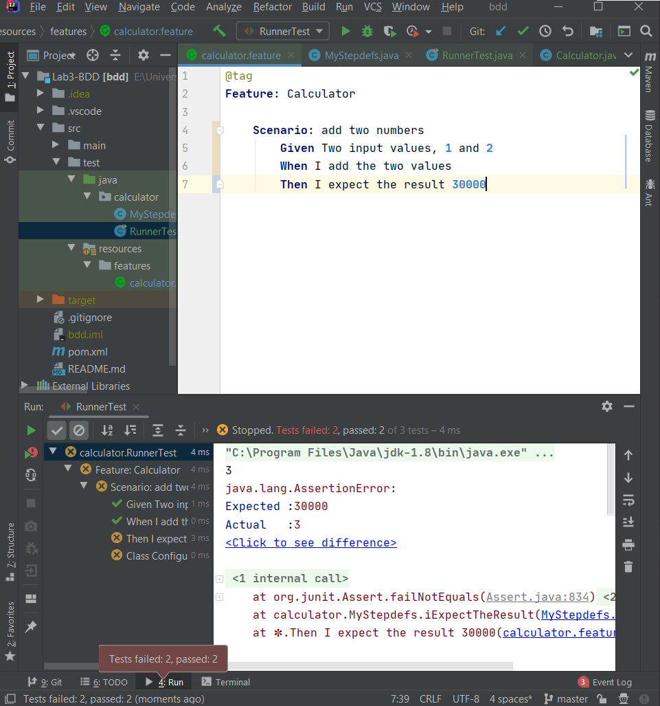

# شرح آزمایش
در این آزمایش می‌خواهیم **روش ایجاد رفتارمحور** را، با به کار بردن آن در یک پروژه‌ی عملی، بیاموزیم. ایجاد رفتارمحور یکی از مشتقات روش ایجاد مبتنی بر آزمونِ نرم‌افزار می‌باشد.\
در روش مبتنی بر آزمون - که در [آزمایش قبل](https://github.com/Sharif-SE-Lab/Lab2-SOLID) به آن پرداخته شد - دریافتیم در این روش ایجاد پیش از شروع فرایند ایجاد نرم‌افزار موارد و سناریوهای تست واحد آن استخراج و با صرف نظر از نحوه طراحی و پیاده‌سازی سیستم جدید برنامه نویسی می‌شوند.
سپس فرایند ایجاد آغاز می‌شود. برنامه ایجاد شده چندین و چند بار بازآرایی شده تا در نهایت تمامی تست‌های از پیش نوشته شده را با موفقیت بگذراند.\
از آنجایی که **روش ایجاد رفتارمحور** از روش ایجاد آزمون محور مشتق می‌شود، می‌توان حدس زد که در این روش نیز تست‌نویسی پیش از ایجاد خود سیستم آغاز می‌گردد. 
تفاوت این روش (BDD) با روش پیشین (TDD) آن است که تمرکز این روش به جای آنکه روی تست واحدهای ریزدانه‌ی مجزایی باشد که تنها در سطح طراحی و پیاده سازی تمرکز دارد، تمرکز آن روی رفتار درشت دانه سیستم است که از سمت کاربر نیز قابل مشاهده می‌باشد.
- در گام اول از این روش ایجاد، مجموعه رفتارهای مورد انتظار سیستم مستند سازی می‌شود.
- در گام دوم به ازای هر رفتار، یک مجموعه سناریو به منظور درخواست سرویس و مشاهده رفتار سیستم به زبان Gherkin - که بسیار نزدیک به زبان انسان و قابل فهم برای کاربر است - مکتوب می‌شود.
- در گام سوم مکتوبات Gherkin با ابزاری به نام Cucumber به یک مجموعه آزمون قابل اجرا در زبان برنامه نویسی پایگاه کد مبدل می‌شود.
- گام چهارم و آخر، ایجاد سیستم و بازآرایی کد تا آنجا که مجموعه آزمون‌ها پاس شوند خواهد بود.
## بخش اول: ایجاد ماشین حساب با عملیات جمع

### مرحله ۱


### مرحله ۲


### مرحله ۳


### مرحله ۵


### مرحله ۶


### مرحله ۷


### مرحله ۸


### مرحله ۹


### مرحله ۱۰


### مرحله ۱۱


### مرحله ۱۲


### مرحله ۱۳


* این عکس پس از درست کردن قسمت result سناریوی قبل و هنگام اجرای مجدد تست گرفته شده است، و ربطی به سناریوی جدید ندارد.


## بخش دوم: سوالات مربوط به مواردی که در تست مرحله‌ی قبل با مشکل مواجه می‌شدند
هنگام اجرای Scenario Outline تست آخر با مشکل undefined مواجه می‌شود.

این مشکل به این دلیل است: پارامتر اول مثال دوم یک عدد منفی است. از آنجا که هنگام ساختن گام‌های تست، الگوی مربوط به پارامتر اول را به صورت "(\\\d+)" در نظر گرفتیم، این الگو عدد منفی را قبول نمی‌کند. در نتیجه، گام مربوطه نمی‌تواند مثال سناریو را به عنوان یک تست در نظر بگیرد و به مشکل undefined بر می‌خوریم.


همانطور که در پایین شکل هم مشخص شده‌است، و باتوجه به توضیحاتی که در مرحله‌ی قبل ذکر کردیم، صرفا نیاز است در مرحله‌ی مشخص‌شده، الگو را طوری تغییر دهیم تا عدد منفی را هم بپذیرد. در اشکال زیر می‌توانید چگونگی این تغییر و نتیجه‌ی موفقیت‌آمیزی که به آن منجر می‌شود را مشاهده کنید.


## بخش سوم: ایجاد ماشین حساب با عملیات‌های متعدد
### ۱. گسترش Calculator

ابتدا کلاس `Calculator` از بخش قبل را به نحوی گسترش می‌دهیم که از عملیات‌های «ضرب» «تقسیم» و «توان»، علاوه بر «جمع»، پشتیبانی کند.\
به این ترتیب طبق روش BDD ابتدا رفتار جدید را توصیف کرده و برای آن سناریو‌های زیر را می‌نویسیم.


سپس به منظور برقراری اصول SOLID، یک واسط تعریف می‌کنیم که شامل مشخصات یک ماشین حسابِ منطبق بر نیازمندی‌های آزمایش باشد.

```java
package calculator;

public interface CalculatorInterface {
    int add(int a, int b);

    int mul(int a, int b);

    int div(int a, int b);

    int pow(int a, int b);
}
```
سپس تست‌های ایجاد شده توسط Cucumber را به نحوی تغییر می‌دهیم که وابسته به واسط `CalculatorInterface` باشند. به منظور منتزع ماندن مستندات، از ذکر پیاده سازی توابع تست در این مستند اجتناب شده است. به منظور مطالعه پیاده‌سازی کامل این کلاس به [این فایل](src/test/java/calculator/CalculatorTest.java) مراجعه کنید.

```java
public class CalculatorTest {
    private CalculatorInterface calculator; // depond upon the interface, not the concrete class (DIP).
    private int value1;
    private int value2;
    private Method method; // use java reflection for accessing the right arithmetic operation in the `calculator`.

    @Given("^Two input values, (\\d+) and (\\d+)$")
    public void twoInputValuesAnd(int arg0, int arg1) {
        // set inputs
    }

    @When("^I add the two values$")
    public void iAddTheTwoValues() {
        // get add method from the calculator (java reflection)
    }

    @When("^the (\\S+) is requested$")
    public void theOperationIsRequested(String func) {
        // get the arithmetic method from `calculator` based on the name given in the scenario (java reflection)
    }

    @Then("^I expect the result (\\d+)$")
    public void iExpectTheResultResult(int expected) {
        // invoke `method` with `value1` and `value2` as inputs.
        // assert if expected result differs from result of the `method` invocation
    }
}
```
حال به ایجاد سیستم جدید می‌پردازیم.
حال کلاس `Calculator` واسط معرفی شده را محقق می‌کند.
برای اینکه کد زیر با پیاده‌سازی متدهای مختلف واسط `CalculatorInterface` شلوغ نشود، از ذکر این پیاده‌سازی ها اجتناب شده. به منظور دیدن این پیاده سازی‌ها به [این فایل](src/main/java/calculator/Calculator.java) مراجعه کنید.

```java
package calculator;

public class Calculator implements CalculatorInterface{
    // specifications in the `Calculator.java` file
}
```
نتیجه اجرای آزمون‌های مابه ازای سناریوهای calculator.feature در زیر نمایش داده شده است.


### ۲. ایجاد CalculatorAdapter

حال رفتار غایی سیستم معرفی می‌شود. سیستم باید توانایی آن را داشته باشد که دو عدد به همراه عملیات بین آن‌ها را به عنوان ورودی دریافت کند. سپس به عنوان خروجی، حاصل عملیات ریاضی بین آن دو عدد و ذیل آن عملگر را بر می‌گرداند. برای این رفتار سناریوهای زیر به زبان Gherkin نوشته شده‌اند.


حال برای دستیابی به رفتار جدید یک واسط دیگر نیاز است. این واسط قابلیت دریافت دو عدد و عملگر ریاضی بین آنها را دارد حاصل عملیاتِ حاصل از دو عملوند ورودی، ذیل عملگر ورودی را به عنوان خروجی باز می‌گرداند. این واسط به صورت زیر تعریف شده است.

```java
package calculator;


public interface UserCalculatorInterface {
    int calculate(int a, int b, char op) throws OperationNotSupportedError;
}
```

با استفاده از Cucumber سناریوهای جدید نوشته شده را به یک کلاس تست تبدیل می‌کنیم. سپس این کلاس تست را صرفا به واسطِ `UserCalculatorInterface` نیازمند می‌سازیم (صرف نظر از کلاسی که در زمان اجرا آن واسط را فراهم می‌آورد).
به منظور مطالعه پیاده‌سازی کامل این کلاس به [این فایل](src/test/java/calculatorAdapter/CalculatorAdapterTest.java) مراجعه کنید.

```java
public class CalculatorAdapterTest {
    /*
    depond upon the interface, not the concrete class (DIP). 
    All test methods in this class see just the `calculate(int, int, char)` method which is specified in the `UserCalculatorInterface`.
    */
    private UserCalculatorInterface calculator;

    /*
    The input numbers and operator needed for our new calculator.
    */
    private int value1;
    private int value2;
    private char operation;
    
    /*
    The actual result which is tended to be compared with the expected result in the gherkin scenarios.
    */
    private int result;


    @Given("^Two input numbers, (\\d+) and (\\d+), and the operation (\\S)$")
    public void twoInputNumbersAndAndTheOperation(int arg0, int arg1, char operation) {
        // setting the input arguments.
    }

    @Then("^I expect the result of calculation (\\d+)$")
    public void iExpectTheResultOfCalculation(int arg0) {
        // comparing the actual result (returned from the calculator) and the expected one (specified in the gherkin scenarios)
    }

    @Then("^I expect error$")
    public void iExpectError() {
        // Assert on not receiving error if the input operator is unsopported
    }
}
```
در گام آخر کلاس محقق کننده‌ی واسط `UserCalculatorInterface` را پیاده سازی می‌کنیم که در واقع یک [Adapter](https://refactoring.guru/design-patterns/adapter) است.\
کلاس `CalculatorAdapter` هم واسط پیشین که تنها عملیات‌های ریاضی را ارائه می‌داد را محقق می کند (`CalculatorInterface`) هم واسط نیازمندی جدید که دریافت عملگر (به همراه دو عدد ورودی) از کاربر است را محقق می‌کند (`UserCalculatorInterface`).\
این کلاس به منظور محقق کردن واسط `CalculatorInterface` به سمت کلاس `Calculator` یک رابطه انجمنی دارد و در واقع فراهم آوری خدمات مورد نیاز این واسط را به `Calculator` واگذاری می‌کند، از همین رو یک Adapter است.\
بخش عمده‌ی این کلاس در زیر نمایش داده شده است. به منظور مشاهده کامل آن به [این فایل](src/main/java/calculator/CalculatorAdapter.java) مراجعه کنید.
```java
public class CalculatorAdapter implements CalculatorInterface, UserCalculatorInterface {
    private final Calculator calculator;

    public CalculatorAdapter() {
        this.calculator = new Calculator();
    }

    public int calculate(int a, int b, char op) throws OperationNotSupportedError{
        switch(op) {
            case '+':
                return this.add(a, b);
            case '*':
                return this.mul(a, b);
            case '/':
                return this.div(a, b);
            case '^':
                return this.pow(a, b);
            default:
                throw new OperationNotSupportedError(op);
        }
    }
}
```
نتیجه اجرای آزمون‌های مابه ازای سناریوهای calculatorAdaptor.feature در زیر نمایش داده شده است.

